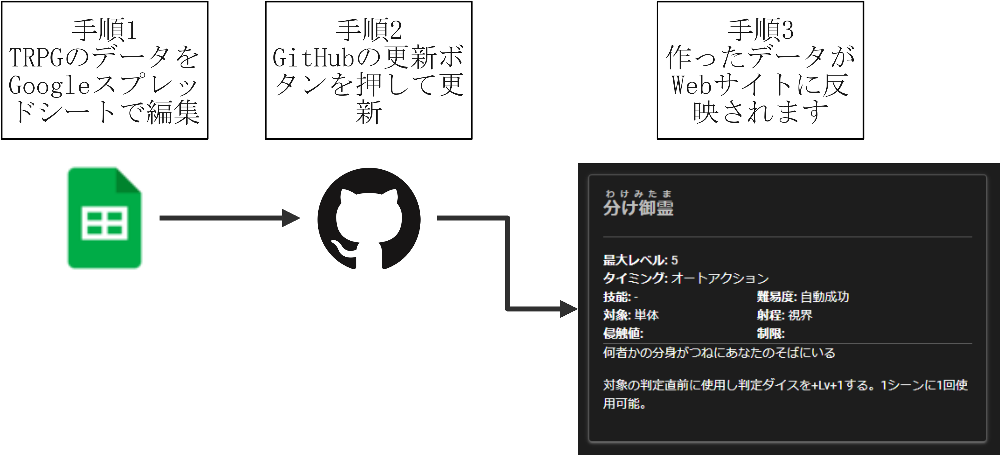
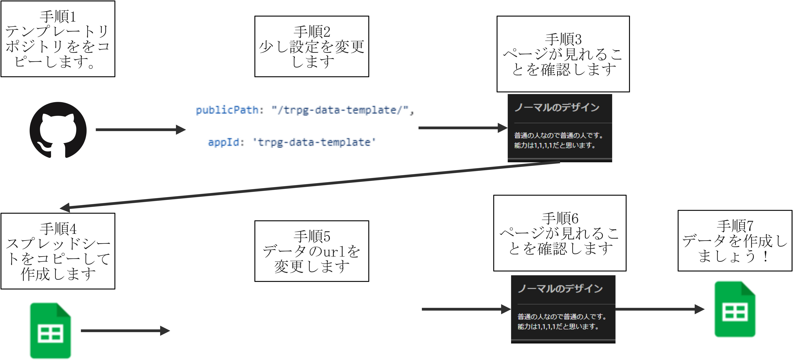

# TRPG データページテンプレート

サンプルページ   
https://marimoiro.github.io/trpg-data-template/#/

データサンプルの Google Spread Sheet   
https://docs.google.com/spreadsheets/d/1vNEaP-Nd96Wscstda9E5Td5JgkYSrUsRdlYRpBZEwDs/edit#gid=1203551871

## これなに？

Google Spread Sheet でTRPGのデータを作りそれをwebページに反映させるテンプレートです。

作業イメージはこんな感じです。


データを作るときにhtmlを考えたくないので作りました、

## このテンプレートの使い方 (とりあえずデータ作ってページ表示させたい)

作業手順は以下になります。  



### 手順1. テンプレートをコピーして作成

このリポジトリを [テンプレートからリポジトリを作成する](https://docs.github.com/ja/repositories/creating-and-managing-repositories/creating-a-repository-from-a-template) を参考に自分用のリポジトリを作成してください。

今回は仮にgithubのユーザー名が [ユーザー名]作成したリポジトリが[リポジトリ名]で作成したとします。  
つまりhttps://github.com/[ユーザー名]/[リポジトリ名] に作成したことにして説明を続けます。

### 手順2. 設定を少し変更します。

[publicPath](https://github.com/Marimoiro/trpg-data-template/blob/main/quasar.config.js#L70)を「/[リポジトリ名] /」に変更します。

[appId]([https://github.com/Marimoiro/trpg-data-template/blob/main/quasar.config.js#L199C17-L199C35](https://github.com/Marimoiro/trpg-data-template/blob/main/quasar.config.js#L199))を好きなものに変更します。

### 手順3. 自分のページがみられる確認します。

リポジトリ上部のActionsから入ったページの上二つが緑色になっていれば、ページができています。

https://[ユーザー名].github.io/[リポジトリ名] にアクセスできればOKです。  
うまくいかない場合はpublicPathの設定が間違えている可能性があります。

### 手順4. スプレッドシートをコピーして作成します。

これで自分のページは見れたので、自分のデータを入れられるようにします。

https://docs.google.com/spreadsheets/d/1vNEaP-Nd96Wscstda9E5Td5JgkYSrUsRdlYRpBZEwDs/edit#gid=1203551871 をコピーしてください。
作成したスプレッドシートを使ってデータを作成できるようにします。

### 手順5. データのURLを変更します。

(scripts/Download-DataToJson.ps1)[https://github.com/Marimoiro/trpg-data-template/blob/main/scripts/Download-DataToJson.ps1]を変更します。

メニュー > ファイル共有 > ウェブに公開 でそれぞれのurlを取得して書き換えてください。 「"」は消さないように注意してください。  
その後シートを少し書き換えてみてください。

### 手順6. ページがみられることを確認します。

Actions > Build & Deploy > Run workflow > Run workflow でデータを取り込めます。
うまく取り込めたらしばらくしたら自分のページが更新されるはずです。

### 手順7. データを更新しましょう。

スプレッドシートを更新したら手順6と同じことをするとデータが更新されます。


## ローカルでの開発手順

[Quasar](https://quasar.dev/)とyarnで作成しています。  
開発の詳しいところはQuasarのページを見てください。

```
yarn install 
```

でインストールして

```
quasar dev
```

でサーバーが立ち上がります。

データの更新は、(scripts/Download-DataToJson.ps1)[https://github.com/Marimoiro/trpg-data-template/blob/main/scripts/Download-DataToJson.ps1]をたたけば、[tree/main/src/data]にあるデータjsonが更新されます。


